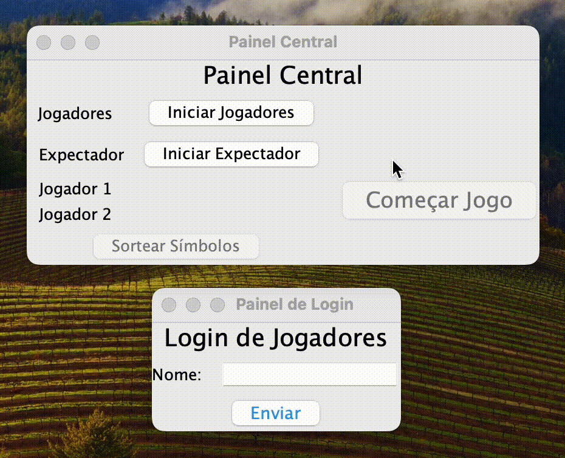
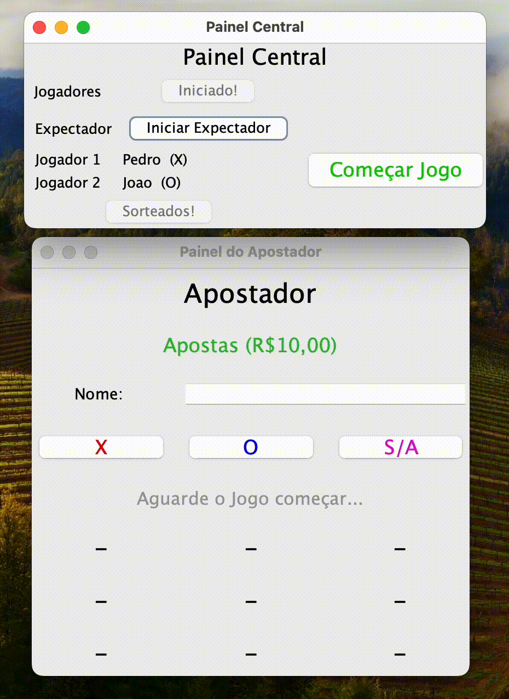

 

   
   # TicTacToe in Java
 

### This is a Tic Tac Toe Project in Java using Swing, Multicasting sockets, protocol UDP and TCP.

The project's idea is to create a distributed tic-tac-toe game via network. Java language with JDK-20 was utilized for its implementation. The game is divided into Players, middleware, and spectator roles.

## Execution and Game

#### Stage 1

Start the central panel and the login panel, then click on "Iniciar Jogadores" in the central panel, and proceed to enter the names of the two players in the login panel, one at a time, and click "Enviar". And then click on "Sortear Símbolos".

   
   
 

 #### Stage 2

Now, start the spectator panel. In the central panel, click on "Iniciar Espectador", then in the spectator panel, enter your name and which symbol you will bet on, or none of the symbols.

   
   
 

 #### Stage 3
 Finally, start players 1 and 2. Click the "Start Game" button and the players and the spectator will be ready to play connected to the same network, in a distributed manner.

 

   
   
 
 

